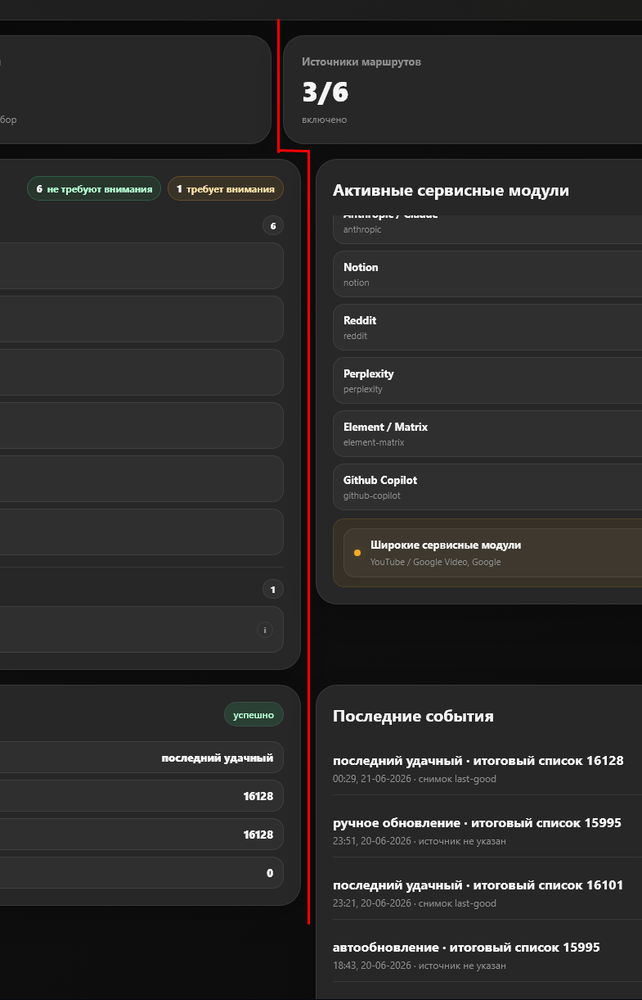
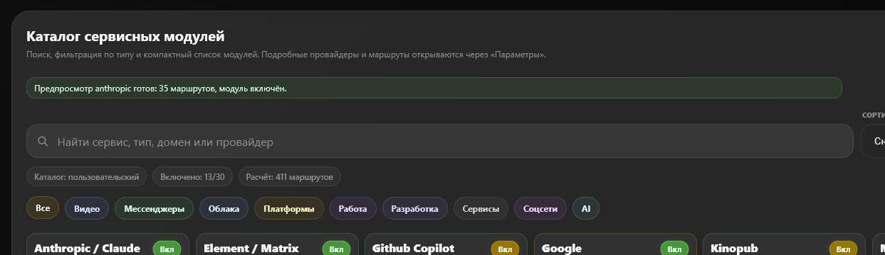

# The333-BGP

**Локальный BGP-портал для управляемой публикации маршрутов на MikroTik.**

The333-BGP поднимает GoBGP speaker на Linux VM, собирает маршруты из готовых источников и сервисных модулей, дедуплицирует/агрегирует их и публикует в MikroTik через BGP. Управление идёт через веб-портал: источники, сервисные модули, Community-профили, диагностика, история, обновления и готовые команды для MikroTik.



[](VERSION)
[](LICENSE)
[](docs/INSTALL.md)
[](docs/INSTALL.md)

## Быстрый старт

Команда рассчитана на чистую Linux VM. Установщик проверит Docker, определит IP VM, спросит BGP-параметры, попросит пароль портала и создаст `.env`.

```bash
curl -fsSL https://raw.githubusercontent.com/The333tech/The333-bgp/main/install.sh | bash
```

Если репозиторий fork-нут или называется иначе:

```bash
curl -fsSL https://raw.githubusercontent.com/The333tech/ИМЯ_РЕПОЗИТОРИЯ/main/install.sh \
  | THE333_REPO_SLUG=The333tech/ИМЯ_РЕПОЗИТОРИЯ bash
```

После установки:

```text
Portal:  http://IP_VM:8090
Backend: http://IP_VM:8088
BGP:     IP_VM:179
Login:   admin
```

Пароль задаётся при установке. Минимум — **8 символов**. Если оставить поле пустым, установщик сгенерирует сильный пароль и сохранит его hash в `/opt/the333-bgp/.env`.

## Что внутри

| Компонент | Назначение |
|---|---|
| `the333-gobgp-core` | GoBGP speaker и BGP-сессия с MikroTik |
| `the333-bgp-backend` | FastAPI backend, расчёт маршрутов, источники, модули, Community, jobs |
| `the333-portal` | React/Vite портал через nginx |
| `scripts/the333bgp.sh` | локальная CLI-команда для status, backup, update |

## Возможности

- **Источники маршрутов**: готовые списки CIDR, ручные записи, выбор нескольких источников одновременно.
- **Сервисные модули**: точечные модули для сервисов вроде OpenAI, Anthropic/Claude, YouTube, Google, Telegram, X/Twitter и других.
- **Найденные сервисы**: seed-каталог из Geosite с 1500+ кандидатами, которые можно добавлять в свой каталог.
- **Дедупликация и агрегация**: итоговый набор маршрутов собирается без лишних дублей.
- **Community-профили**: база для разных наборов маршрутов под разные BGP community.
- **История и диагностика**: последние обновления, ready/status, GoBGP output, сравнение наборов маршрутов.
- **Обновления**: каркас GitHub manifest-based обновлений с backup перед заменой файлов.



## Управление на VM

```bash
cd /opt/the333-bgp

./scripts/the333bgp.sh status
./scripts/the333bgp.sh backup
./scripts/the333bgp.sh check-update
./scripts/the333bgp.sh update
```

## Безопасность

The333-BGP рассчитан на запуск в доверенной локальной сети рядом с MikroTik.

**Не открывай `8090`, `8088` и `179` напрямую в Интернет.**

Для доступа извне используй VPN, firewall allowlist или reverse proxy с TLS и дополнительной авторизацией.

Подробнее:

- [SECURITY.md](SECURITY.md)
- [docs/PRODUCTION_CHECKLIST.md](docs/PRODUCTION_CHECKLIST.md)

## Восстановление пароля

Новые установки хранят hash пароля в `/opt/the333-bgp/.env`:

```env
WEB_USER=admin
WEB_PASSWORD=
WEB_PASSWORD_HASH=pbkdf2_sha256:...
```

Смена пароля на VM:

```bash
cd /opt/the333-bgp
./scripts/the333bgp.sh set-password
```

Команда создаёт backup `.env`, записывает новый hash и перезапускает только backend. GoBGP core при этом перезапускать не нужно.

## Документация

- [Полная инструкция установки](docs/INSTALL.md)
- [Production checklist](docs/PRODUCTION_CHECKLIST.md)
- [Security policy](SECURITY.md)
- [Changelog](CHANGELOG.md)

## Обновления

В `.env`:

```env
PRODUCT_VERSION=0.1
PRODUCT_CHANNEL=stable
PRODUCT_UPDATE_MANIFEST_URL=https://raw.githubusercontent.com/The333tech/The333-bgp/main/update-manifest.json
PRODUCT_UPDATE_ENABLED=false
PRODUCT_UPDATE_COMMAND=/opt/the333-bgp/scripts/the333bgp.sh update --non-interactive
```

По умолчанию обновление из портала отключено. Это правильно для production: backend-контейнер не должен получать прямой доступ к Docker-хосту. Для включения обновлений из портала нужен отдельный host-updater слой с ограниченной командой, backup и проверкой `sha256`.

## License

MIT. См. [LICENSE](LICENSE).
